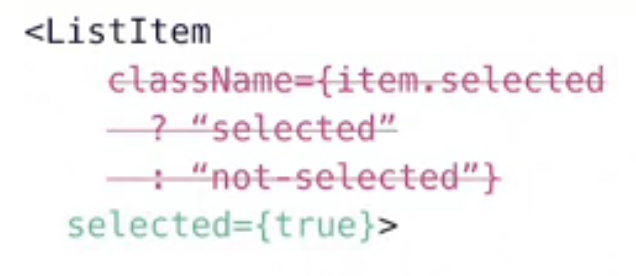
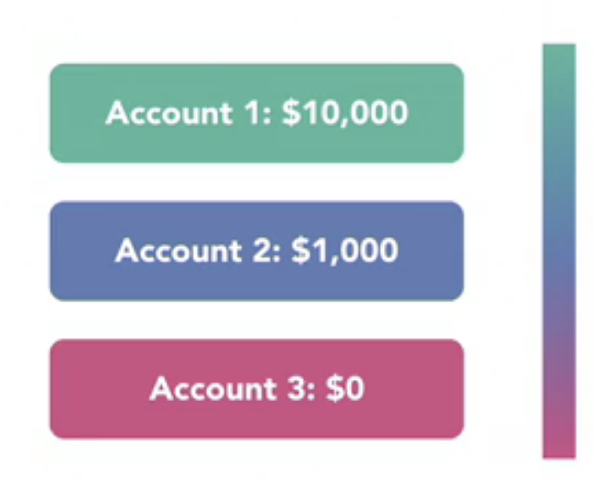

We need to set style dynamically depending the state(disable/enable, selected/unselected) of component.
This logic should be directly inside the components.

We need a way to calculate value in the style based on data dynamically
